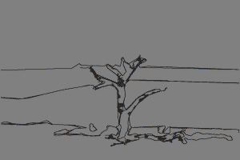

# Underpainting

Underpainting turns a reference photo into a set of study aids for representational
painting: a simplified value study, a limited paint palette with real tube names, a
staged build-order preview, and a written step-by-step. It's for painting students
staring at a photo who don't know what order to build it in.

**Live app:** [underpainting-o8cslvzblappesmjatdqgru.streamlit.app](https://underpainting-o8cslvzblappesmjatdqgru.streamlit.app)

Free-tier apps sleep after a period of inactivity, so a cold visit may show a wake-up
screen for the first 30 seconds or so. Here's the build-order output on the app's own
sample photo, so the repo tells the story even while it's waking up:



*The animation above is derived from "Dead Vlei, Sossusvlei, Namibia" by
[Diego Delso](https://delso.photo)
([source](https://commons.wikimedia.org/wiki/File:Dead_Vlei,_Sossusvlei,_Namibia,_2018-08-06,_DD_086.jpg)),
licensed [CC BY-SA 4.0](https://creativecommons.org/licenses/by-sa/4.0/). It is a modified
version of that photograph and is offered under the same license. See
[Credits](#credits-and-licensing).*

---

## Tech stack

| Piece | Why |
|---|---|
| **Streamlit** | Ships a working UI without writing frontend code, and deploys free to a public URL: the two things a 3-weekend solo portfolio project needs most. |
| **Pillow + pillow-heif** | Image I/O, EXIF rotation, and HEIC support. Real photos come straight off a phone, sideways, sometimes in Apple's format. |
| **OpenCV (headless)** | Color-space conversion: grayscale for the value study, Lab for perceptual palette clustering and paint matching. Headless build specifically, since the normal `opencv-python` package expects desktop graphics libraries that don't exist on a cloud container. |
| **numpy** | The actual pixel math. Every image is an array; every transformation is arithmetic on that array. |
| **Anthropic API** | The one deliberately non-deterministic piece: turning a photo plus a hand-written painting rubric into a written, specific step-by-step. Everything else in the app is plain image processing on purpose, see [docs/ARCHITECTURE.md](docs/ARCHITECTURE.md) for why. |

## Setup

Starting from a fresh clone, on macOS/Linux (Windows notes inline):

```bash
# 1. Clone and enter the project
git clone https://github.com/Charlotte-Wagner/Underpainting.git
cd Underpainting

# 2. Create and activate a virtual environment
#    (Python 3.12 recommended, matching the deployed environment; 3.10+ works)
python3 -m venv .venv
source .venv/bin/activate        # Windows: .venv\Scripts\activate

# 3. Install dependencies
pip install -r requirements.txt

# 4. Add an API key, only needed for the "Generate step-by-step guide" button.
#    Everything else runs with no key at all, and with no key that button
#    still shows the saved guide for the sample photo. See .env.example for
#    the variable name; get a real key at console.anthropic.com.
mkdir -p .streamlit
echo 'ANTHROPIC_API_KEY = "sk-ant-your-key-here"' > .streamlit/secrets.toml

# 5. Run it
streamlit run app.py
```

Opens at `http://localhost:8501`. No photo on hand? The app has a sample-photo button
that runs the same pipeline as a real upload. Every command above was run from a clean
clone before this README shipped, none of it is guessed.

## Running the checks

No pytest suite yet (see [Status](#status)); instead, each image-math step has a
companion script that builds its own tiny arrays, asserts on them, and fails loudly on a
wrong answer. That's a deliberate substitute for a full suite while the project is this
small (see [CLAUDE.md](CLAUDE.md)), not a placeholder nobody wrote yet:

```bash
python test_posterize.py   # value study: posterize() anchors at true black/white
python test_palette.py     # k-means palette clustering in Lab
python test_paints.py      # nearest-tube paint matching by measured Lab distance
python test_stages.py      # the four build-order stages, computed independently
python test_gif.py         # cross-fade GIF, one shared color table (no flicker)
python test_rubric.py      # the rubric reaches the model prompt unaltered
python test_stats.py       # value range and dominant temperature measurement
python test_demo_writeup.py  # the saved fallback guide still matches the rubric and photo
```

Each prints its own checks and ends with `ALL CHECKS PASSED`. For a single function by
hand instead of a full script:

```bash
python -c "
from imaging import posterize, posterize_output_values
import numpy as np
gray = np.array([[0, 50, 128, 200, 255]], dtype=np.uint8)
print('posterize(gray, 3):', posterize(gray, 3).tolist())
print('possible 3-level values:', posterize_output_values(3).tolist())
"
```

Expected output: `posterize(gray, 3)` maps every pixel onto `[0, 128, 255]`, the point
being that the lightest value lands on true white, not short of it (see
[docs/ARCHITECTURE.md](docs/ARCHITECTURE.md) for why that's the whole design decision).

## Status

**Working today:**
- Photo upload (JPEG, PNG, HEIC) with EXIF-safe rotation and resize to a 1200px max
  dimension, plus a one-click sample photo for visitors without one handy
- Value study: posterize to 3 and 5 tonal levels, endpoints anchored at true black and
  true white
- Palette extraction: k-means clustering in Lab color space, 6 swatches sorted by how
  much of the canvas each covers, each matched to the nearest tube in a measured-Lab
  paint reference
- The four-stage build-order filmstrip, computed independently per stage from the same
  source photo, and its cross-faded animated GIF with one shared color table
- A written step-by-step guide from the Anthropic API, built from a hand-written
  painting rubric plus this photo's own measured value range and temperature, gated
  behind an explicit button so it never fires on upload, and cached so the same photo
  doesn't trigger a repeat call
- A demo-mode fallback: if that API call fails, the sample photo falls back to a saved
  guide generated earlier from the same photo and the same rubric, labeled on screen as
  saved rather than live, so the page stays complete when the key or the balance is not
- Eight check scripts covering the math above (see
  [Running the checks](#running-the-checks)), all passing
- Dev Container config for GitHub Codespaces

**Intentionally out of scope for v1:**
- User accounts, saved history, or any database
- Mobile app or native client
- Payments
- Live camera capture (upload only)

Cutting these isn't a gap: v1 is upload-a-photo, get-a-result, nothing more, on
purpose. Anything else goes in a running v2 list instead of into this branch.

## Credits and licensing

**The sample photograph.** `assets/sample-dead-vlei.jpg` is "Dead Vlei, Sossusvlei,
Namibia, 2018-08-06, DD 086" by [Diego Delso](https://delso.photo), from
[Wikimedia Commons](https://commons.wikimedia.org/wiki/File:Dead_Vlei,_Sossusvlei,_Namibia,_2018-08-06,_DD_086.jpg),
licensed [CC BY-SA 4.0](https://creativecommons.org/licenses/by-sa/4.0/). **Modified:**
downscaled from the 8078x5399 original to a 1920px-wide rendition. It is included as
third-party material, not as work of this project.

`assets/sample-output.gif` is an adaptation of that photograph produced by this app's own
pipeline, and is therefore also licensed
[CC BY-SA 4.0](https://creativecommons.org/licenses/by-sa/4.0/). The same applies to the
value studies, palette swatches, stage images, and animation the running app derives from
the sample photo.

Including a ShareAlike image alongside the source does not place the source under
ShareAlike: the repository is an aggregation, and the code is not an adaptation of the
photograph. Only material actually derived from the photo carries the license forward.

**The paint reference data.** CIE Lab values in `paints.py` come from Golden Artist
Colors' published measurements for Williamsburg oils, cited in that file. Underpainting is
independent and is not affiliated with or endorsed by Golden Artist Colors or Williamsburg.

**Photos you upload** are decoded in memory to render the page, and are sent to the
Anthropic API only if you press the button that asks for a written guide. This app writes
no image to disk (every encode goes to an in-memory buffer) and has no database. It does
keep a Streamlit in-memory cache keyed on the uploaded bytes, so pressing the button twice
for the same photo doesn't bill a second API call; that cache is not persisted and is lost
when the server restarts.
